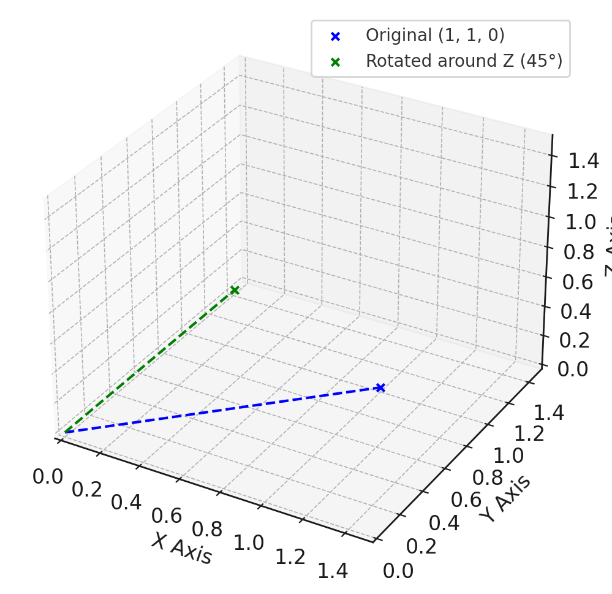
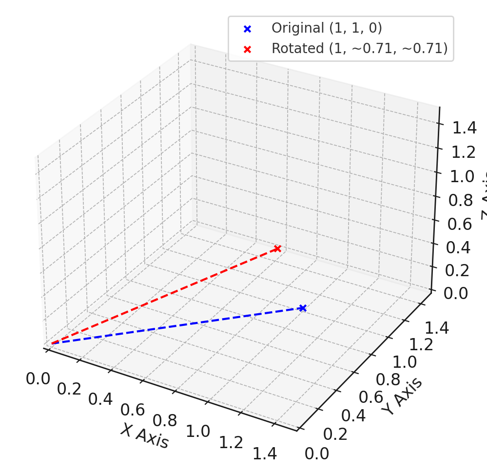
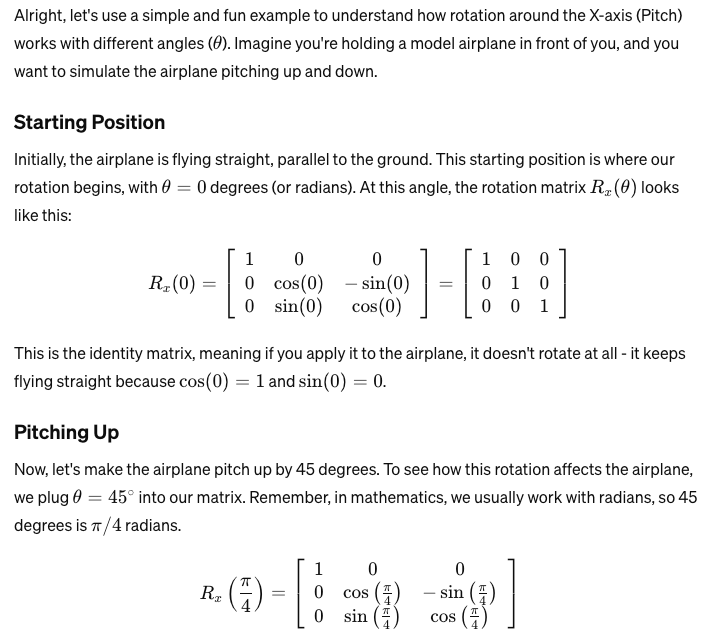
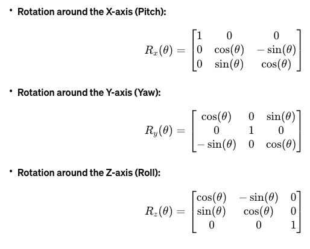

In the 3D coordinate system displayed, the blue dot represents the point's original position (1, 1, 0), and the green dot shows its new position after rotating 45 degrees around the Z-axis, now approximately (0, 2**(1/2) , 0).
z axis become a rod

To intuitively understand rotating "around" the X-axis, imagine the X-axis as a fixed rod or skewer that goes through an object, and you can only spin the object around this rod. The rotation doesn't move the object closer to or further from you; it just tilts it upwards or downwards. Here’s a way to visualize it with everyday scenarios:

### Holding a Book

Imagine you're holding a book directly in front of you so that the book's cover faces you, and its spine is to your left. If the book were to rotate around the X-axis (which runs from the spine to the edge of the cover, through the book):

- **Tilting Upwards**: Lifting the bottom edge of the book towards you (and pushing the top edge away) is like rotating the book around the X-axis in one direction.
- **Tilting Downwards**: Pushing the bottom edge of the book away from you (and pulling the top edge towards you) is like rotating it around the X-axis in the opposite direction.

### Using Your Arm

Extend your arm straight out in front of you, with your palm facing down. Now, without moving your shoulder:

- **Tilting Up**: Bend your wrist upwards. Your hand moves up while your arm remains in place. This action is similar to an object rotating around the X-axis.
- **Tilting Down**: Bend your wrist downwards. Your hand moves down. Again, this simulates rotation around the X-axis.

### Airplane Pitch

Consider how an airplane pitches. When the nose of the airplane tilts up towards the sky, that's a pitch up, and it's like the airplane is rotating around an imaginary horizontal line (X-axis) that runs from wingtip to wingtip. When the nose points down towards the ground, that's a pitch down, indicating a rotation in the opposite direction around the same axis.

### Key Points

- **Fixed Axis**: The X-axis is like an immovable rod. Everything spins around it but doesn’t slide along it.
- **Direction Matters**: Rotation can be clockwise or counterclockwise, viewed from a specific point. If you stand looking in the direction of the positive X-axis, clockwise rotation would tilt objects down, while counterclockwise would tilt them up.
- **3D Space**: Every point of the object moves in a circle in the YZ plane (the plane perpendicular to the X-axis), but their distances from the X-axis remain constant.

Thinking about these examples, you can get a good intuitive grasp of what it means to rotate something around the X-axis in a 3-dimensional space.

Alright, let's use a simple and fun example to understand how rotation around the X-axis (Pitch) works with different angles (\(\theta\)). Imagine you're holding a model airplane in front of you, and you want to simulate the airplane pitching up and down.

### Starting Position
Initially, the airplane is flying straight, parallel to the ground. This starting position is where our rotation begins, with \(\theta = 0\) degrees (or radians). At this angle, the rotation matrix \(R_x(\theta)\) looks like this:

\[
R_x(0)=\left[\begin{array}{ccc}
1 & 0 & 0 \\
0 & \cos (0) & -\sin (0) \\
0 & \sin (0) & \cos (0)
\end{array}\right] = \left[\begin{array}{ccc}
1 & 0 & 0 \\
0 & 1 & 0 \\
0 & 0 & 1
\end{array}\right]
\]

This is the identity matrix, meaning if you apply it to the airplane, it doesn't rotate at all - it keeps flying straight because \(\cos(0) = 1\) and \(\sin(0) = 0\).

### Pitching Up
Now, let's make the airplane pitch up by 45 degrees. To see how this rotation affects the airplane, we plug \(\theta = 45^\circ\) into our matrix. Remember, in mathematics, we usually work with radians, so 45 degrees is \(\pi/4\) radians.

\[
R_x\left(\frac{\pi}{4}\right)=\left[\begin{array}{ccc}
1 & 0 & 0 \\
0 & \cos \left(\frac{\pi}{4}\right) & -\sin \left(\frac{\pi}{4}\right) \\
0 & \sin \left(\frac{\pi}{4}\right) & \cos \left(\frac{\pi}{4}\right)
\end{array}\right]
\]

Given that \(\cos(\pi/4) = \sin(\pi/4) = \sqrt{2}/2\), the matrix becomes:

\[
R_x\left(\frac{\pi}{4}\right)=\left[\begin{array}{ccc}
1 & 0 & 0 \\
0 & \sqrt{2}/2 & -\sqrt{2}/2 \\
0 & \sqrt{2}/2 & \sqrt{2}/2
\end{array}\right]
\]

When applied, this matrix tilts the nose of the airplane upwards, making a 45-degree angle with the horizon. The effect is like the airplane beginning to climb.

### Pitching Down
What if we want the airplane to pitch down by 45 degrees instead? We use \(\theta = -45^\circ\) (or \(-\pi/4\) radians). The rotation matrix then becomes:

\[
R_x\left(-\frac{\pi}{4}\right)=\left[\begin{array}{ccc}
1 & 0 & 0 \\
0 & \cos \left(-\frac{\pi}{4}\right) & -\sin \left(-\frac{\pi}{4}\right) \\
0 & \sin \left(-\frac{\pi}{4}\right) & \cos \left(-\frac{\pi}{4}\right)
\end{array}\right]
\]

Since \(\cos(-\theta) = \cos(\theta)\) and \(\sin(-\theta) = -\sin(\theta)\), the matrix looks the same as when pitching up, but with the sine values having opposite signs:

\[
R_x\left(-\frac{\pi}{4}\right)=\left[\begin{array}{ccc}
1 & 0 & 0 \\
0 & \sqrt{2}/2 & \sqrt{2}/2 \\
0 & -\sqrt{2}/2 & \sqrt{2}/2
\end{array}\right]
\]

This matrix tips the nose of the airplane downwards, making it as if the airplane is diving.

### Understanding the Change
So, as we adjust \(\theta\), the rotation matrix \(R_x(\theta)\) simulates the airplane's nose tilting up or down around the x-axis. This is exactly how the pitch control works in flight, and it's controlled in our 3D world with this neat mathematical tool.

Sure, let's simplify that explanation about the 3x3 rotation matrix within the Camera to World matrix, focusing on how it affects camera orientation with an easier approach.

### What is a Rotation Matrix?

Imagine you have a toy camera that you can tilt up and down, swivel left and right, and roll side to side. These movements are akin to rotating the camera around the x, y, and z axes, respectively. In the 3D digital world, we use a special kind of "magic grid," called a rotation matrix, to tell the computer exactly how to tilt, swivel, or roll our virtual camera.

### The 3x3 Part of the Matrix: The Director of the Camera

The 3x3 portion inside the Camera to World matrix is like the director of a movie, telling the camera where to look. This part doesn't move the camera from one place to another; instead, it rotates the camera to face a certain direction. It ensures that whatever the camera is pointing at is what gets captured in the scene.

### How Does it Work?

1. **Tilting Up/Down (Pitch)**: Imagine nodding your head. That's like rotating around the x-axis.
2. **Swiveling Left/Right (Yaw)**: Imagine shaking your head. That's like rotating around the y-axis.
3. **Rolling Side to Side (Roll)**: Imagine tilting your head to rest your ear on your shoulder. That's like rotating around the z-axis.

Each of these movements changes the direction the camera is facing, without moving it from its spot.

### Combining Movements

Just like you can nod and then shake your head, the camera can combine these rotations to look in any direction. The 3x3 rotation matrix combines these movements in a precise way, so the camera ends up pointing exactly where it needs to, like aiming a telescope at a star.

### Why is it Important?

Without this matrix, our virtual camera would always look straight ahead, no matter where it is in the 3D world. By using the rotation matrix, we can have the camera look around, up at the sky, down at the ground, or any which way we like, just like how you can look around a room by turning your head.

### Putting it Simply

If you were standing in the center of a room, holding a camera, and you wanted to take pictures of every corner without moving your feet, you'd naturally turn and tilt the camera in different directions. The 3x3 rotation matrix is how we tell our virtual camera to do the same thing in a 3D computer-generated scene. It's all about directing the camera's gaze, making sure it captures the part of the digital world we're interested in showing.

Certainly! The 3x3 rotation matrix within the Camera to World (C2W) matrix plays a crucial role in determining the orientation of the camera within the 3D world space. This matrix allows the camera to be rotated around the world's x, y, and z axes, effectively directing the camera's "gaze" or viewpoint in any desired direction. Let's break down how this rotation matrix works and why it's so important.

### The Basics of Rotation Matrices

A rotation matrix is a mathematical construct used in linear algebra to perform rotations in space. In 3D space, separate rotation matrices correspond to rotations around the x, y, and z axes, respectively. These matrices are defined as follows:

Here, \(\theta\) represents the angle of rotation. These matrices use trigonometric functions to calculate the new positions of points after rotation, ensuring that the points remain the same distance from the axis of rotation, preserving the geometric integrity of the rotated object.

### Combining Rotations

In practice, to orient a camera (or any object) in 3D space, we might need to combine rotations around multiple axes. This is achieved by multiplying the respective rotation matrices together. The combined rotation matrix that results from this multiplication is what we see in the 3x3 portion of the C2W matrix.

The order of multiplication matters due to the non-commutative nature of matrix multiplication. For example, rotating around the x-axis and then the y-axis will yield a different result than rotating around the y-axis and then the x-axis.

### The 3x3 Rotation Matrix in the C2W Matrix

This 3x3 portion embedded within the 4x4 C2W matrix dictates the camera's orientation by specifying how it is rotated relative to the world's coordinate axes. By altering the camera's orientation, we change the direction in which the camera "looks" or points within the 3D scene.

- When a point or vector is multiplied by this rotation matrix, its orientation is adjusted according to the rotations encapsulated by the matrix.
- This capability is crucial for 3D rendering and visualization, allowing us to simulate the effect of a camera looking around a 3D scene from a fixed position.

### Example

Suppose we have a camera looking straight down the world's z-axis. If we want the camera to look towards the positive x-axis instead, we can apply a rotation around the y-axis (yaw). By incorporating the appropriate rotation matrix into the C2W matrix, we effectively reorient the camera within the scene.

In summary, the 3x3 rotation matrix within the C2W matrix is a powerful tool for controlling camera orientation in 3D space, allowing for the simulation of virtually any viewpoint by rotating the camera around the scene's axes.